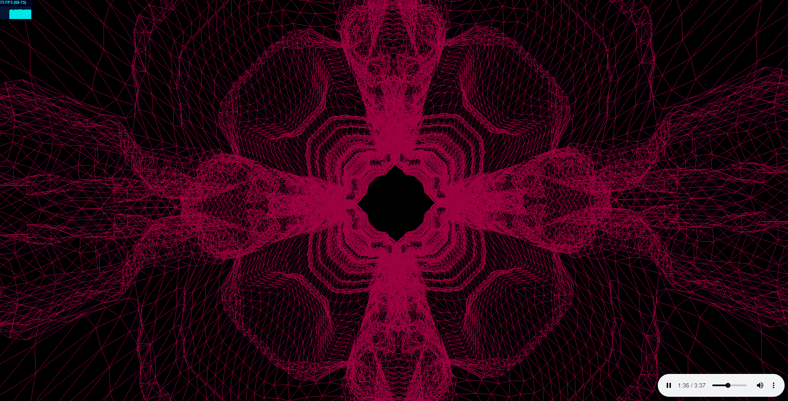

<h1 align="center">  3D Music Visualization</h1>

## About

3D visualization of music using Three.js and web audio API

### Main screen



### Technologies

* Language: **TS, JS**
* Library: **THREE.js**
* Technologies: **Web Audio API, Webpack**

## Installing

**Firstly** clone the project.

```git
git clone https://github.com/l1ve4code/3d-music-visualizer.git
```

**Secondly** install dependencies
```cmd
npm install
```

**Thirdly** run project
```cmd
npm run dev
```

## Author

* Telegram: **[@live4code](https://t.me/live4code)**
* Email: **steven.marelly@gmail.com**
