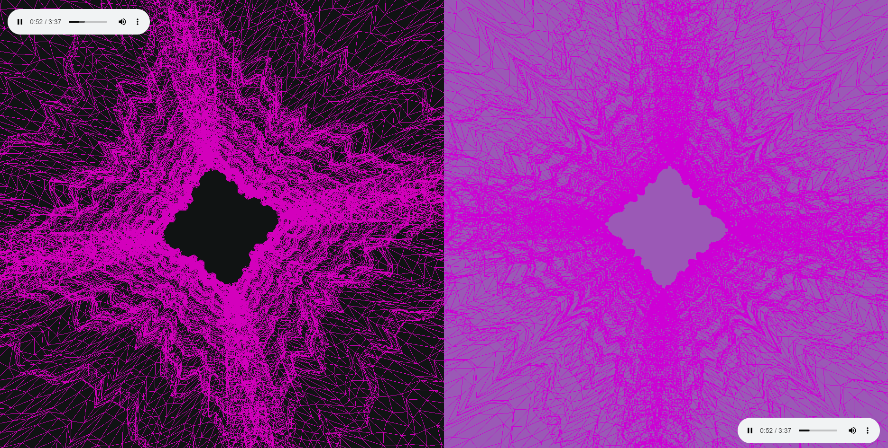

<h1 align="center">  3D Music Visualization</h1>

## About

3D visualization of music using Three.js and web audio API

[Try it here](http://3d-music-visualizer.std-926.ist.mospolytech.ru)

### Main screen


### Additional screen



### Technologies

* Language: **TS, JS**
* Library: **THREE.js**
* Technologies: **Web Audio API, Webpack**

## Installing

**Firstly** clone the project.

```git
git clone https://github.com/l1ve4code/3d-music-visualizer.git
```

**Secondly** install dependencies
```cmd
npm install
```

**Thirdly** run project

### For watch

```cmd
npm run watch
```

### For build

```cmd
npm run build
```


## Author

* Telegram: **[@live4code](https://t.me/live4code)**
* Email: **steven.marelly@gmail.com**

## Contributors ✨

<table>
  <tr>
    <td align="center"><a href="https://github.com/Liverdox"><br /><sub><b>Liverdox</b></sub></a></td>
  </tr>
</table>